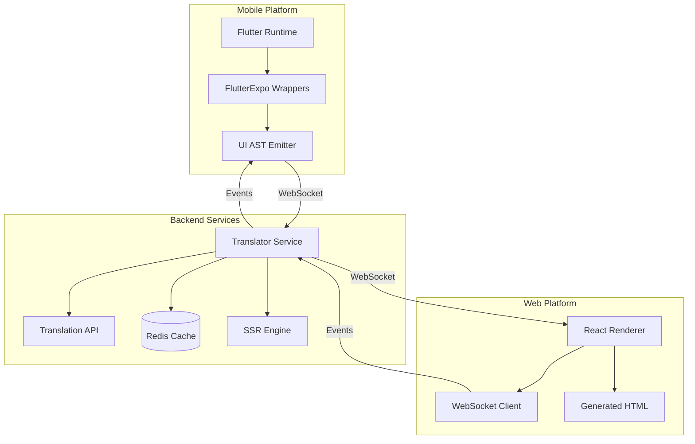

# Design Document

## Overview

FlutterExpo implements a real-time UI synchronization system where Flutter applications serve as the authoritative source for both mobile and web experiences. The architecture consists of three primary components: the instrumented Flutter runtime, a translator service, and a React-based web renderer. Communication flows through WebSocket connections, enabling real-time UI updates and bidirectional event handling.

The system addresses the fundamental challenge of maintaining Flutter's development experience while providing SEO-optimized, accessible web applications. By translating Flutter's widget tree into a structured AST and mapping it to React components, we achieve platform-specific optimization without sacrificing the single-source-of-truth principle.

## Architecture

### High-Level System Architecture



### Component Interaction Flow

1. **Flutter Runtime** executes application logic and renders mobile UI
2. **FlutterExpo Wrappers** intercept widget creation and emit UI AST
3. **Translator Service** receives AST, processes translations, and maps to React specs
4. **React Renderer** receives component specifications and renders web UI
5. **Event Loop** handles user interactions from web back to Flutter runtime

## Components and Interfaces

### Flutter Runtime Components

#### UI AST Emitter
- **Purpose**: Converts Flutter widget tree to structured JSON representation
- **Interface**: WebSocket connection to Translator Service
- **Key Methods**:
  - `emitUIUpdate(ast: UIASTNode)`: Send full UI tree
  - `emitStateDelta(changes: StateChange[])`: Send incremental updates
  - `handleEvent(event: UIEvent)`: Process incoming user interactions

#### FlutterExpo Wrapper Widgets
- **Purpose**: Instrumented Flutter widgets that maintain original behavior while emitting AST
- **Supported Types**: TText, TButton, TContainer, TImage, TRow, TColumn, TListView
- **Interface**: Standard Flutter Widget API with additional AST emission
### T
ranslator Service Components

#### AST Processor
- **Purpose**: Receives and validates UI AST from Flutter runtime
- **Responsibilities**:
  - AST validation and sanitization
  - Diff calculation for incremental updates
  - State management and caching
- **Interface**: WebSocket server accepting UI_UPDATE messages

#### Widget Mapper
- **Purpose**: Maps Flutter widget types to React component specifications
- **Mapping Strategy**:
  - Direct mapping for common widgets (Text → p/h1, Button → button)
  - Layout containers to CSS flexbox (Row/Column → flex containers)
  - Custom fallbacks for unsupported widgets
- **Configuration**: JSON mapping table with extensible widget definitions

#### Translation Engine
- **Purpose**: Handles text localization and caching
- **Features**:
  - Batch translation requests for performance
  - Multi-provider support (Google, Azure, local models)
  - Translation cache with TTL and invalidation
  - Fallback to original text on translation failure

#### WebSocket Manager
- **Purpose**: Manages real-time connections with web clients
- **Capabilities**:
  - Connection pooling and load balancing
  - Message broadcasting to multiple clients
  - Event forwarding from web to Flutter
  - Connection health monitoring and reconnection

### React Renderer Components

#### Component Registry
- **Purpose**: Maps generic component specifications to React components
- **Supported Components**:
  - Layout: Container, Row, Column, Stack
  - Text: Text with styling and semantic mapping
  - Interactive: Button, TextField, Checkbox
  - Media: Image with lazy loading and optimization
  - Lists: VirtualizedList for performance

#### Event Handler
- **Purpose**: Captures user interactions and sends to Translator Service
- **Event Types**: onClick, onChange, onSubmit, onFocus, onBlur
- **Optimization**: Event batching and debouncing for performance

#### State Synchronizer
- **Purpose**: Manages local state and synchronization with Flutter runtime
- **Features**:
  - Optimistic updates for immediate feedback
  - Conflict resolution for concurrent updates
  - Offline state queuing and replay

## Data Models

### UI AST Schema

```typescript
interface UIASTNode {
  id?: string;
  type: string;
  props: Record<string, any>;
  style?: StyleProperties;
  children?: UIASTNode[];
  textId?: string;
  text?: string;
}

interface UIASTDocument {
  screenId: string;
  route: string;
  timestamp: string;
  language: string;
  tree: UIASTNode;
  state: Record<string, any>;
  assets: AssetReference[];
  events: EventBinding[];
}

interface EventBinding {
  componentId: string;
  event: string;
  action: string;
  parameters?: Record<string, any>;
}
```

### React Component Specification

```typescript
interface ReactComponentSpec {
  type: string;
  props: Record<string, any>;
  children?: ReactComponentSpec[];
  events?: EventHandler[];
  style?: CSSProperties;
}

interface EventHandler {
  event: string;
  handler: string;
  parameters?: Record<string, any>;
}
```

### Translation Cache Model

```typescript
interface TranslationEntry {
  textId: string;
  sourceText: string;
  sourceLang: string;
  targetLang: string;
  translatedText: string;
  timestamp: Date;
  provider: string;
}
```

## Error Handling

### Flutter Runtime Error Handling
- **Widget Wrapper Failures**: Graceful degradation to standard Flutter widgets
- **WebSocket Connection Loss**: Queue AST updates and replay on reconnection
- **AST Emission Errors**: Log errors and continue with mobile-only functionality

### Translator Service Error Handling
- **Translation API Failures**: Fallback to cached translations or original text
- **WebSocket Connection Issues**: Implement exponential backoff and reconnection
- **Invalid AST Data**: Sanitize and provide default fallback components
- **High Load Scenarios**: Implement circuit breakers and rate limiting

### React Renderer Error Handling
- **Component Mapping Failures**: Render fallback div with error boundary
- **WebSocket Disconnection**: Show offline indicator and queue user interactions
- **Rendering Errors**: Error boundaries with graceful fallback UI

## Testing Strategy

### Unit Testing
- **Flutter Wrappers**: Test AST emission accuracy and Flutter widget behavior preservation
- **Translator Service**: Test widget mapping, translation caching, and WebSocket handling
- **React Renderer**: Test component rendering and event handling

### Integration Testing
- **End-to-End Flow**: Test complete Flutter → Translator → React rendering pipeline
- **Real-time Synchronization**: Test UI updates and event roundtrip timing
- **Translation Pipeline**: Test multi-language support and caching behavior

### Performance Testing
- **WebSocket Throughput**: Test concurrent connections and message handling
- **Translation API Load**: Test batch processing and rate limiting
- **React Rendering Performance**: Test large component trees and update frequency

### Accessibility Testing
- **Semantic HTML Generation**: Validate ARIA attributes and semantic structure
- **Screen Reader Compatibility**: Test with assistive technologies
- **Keyboard Navigation**: Ensure full keyboard accessibility

## Security Considerations

### Authentication and Authorization
- **WebSocket Authentication**: JWT-based authentication for Flutter runtime connections
- **API Key Management**: Secure storage and rotation of translation API keys
- **Client Authentication**: Validate web client connections and rate limiting

### Data Protection
- **Translation Privacy**: Option to disable external translation APIs for sensitive content
- **Content Sanitization**: Sanitize all user-generated content in AST
- **Secure Communication**: TLS encryption for all WebSocket and HTTP communications

### Input Validation
- **AST Validation**: Schema validation for all incoming UI AST data
- **Event Sanitization**: Validate and sanitize all user interaction events
- **XSS Prevention**: Escape all dynamic content in generated HTML